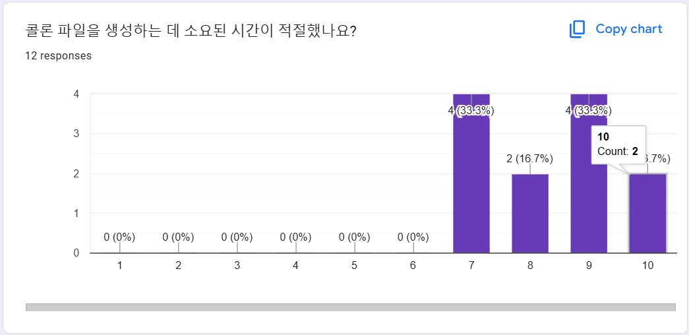

<!-- Template for PROJECT REPORT of CapstoneDesign 2024-2H, initially written by khyoo -->
<!-- 본 파일은 2024년도 컴공 졸업프로젝트의 <2차보고서> 작성을 위한 기본 양식입니다. -->
<!-- 아래에 "*"..."*" 표시는 italic체로 출력하기 위해서 사용한 것입니다. -->
<!-- "내용"에 해당하는 부분을 지우고, 여러분 과제의 내용을 작성해 주세요. -->

# Team-Info
| (1) 과제명 | **COMMA : 시·청각장애 학습자를 위한 AI 기반 학습 보조 프로그램**
|:---  |---  |
| (2) 팀 번호 / 팀 이름 | 01-따뜻한 코끼리 마리오 |
| (3) 팀 구성원 | 양지원(2176211): 리더, AI   최시원(2271061): 팀원,백엔드  박예나(2271028): 팀원, 프론트엔드  |
| (4) 팀 지도교수 | 심재형 교수님 |
| (5) 팀 멘토 | 김기휘 / CTO / Fliption |
| (6) 과제 분류 | 산학과제 |
| (6) 과제 키워드 | STT, NLP, Vision, Gen AI  |
| (7) 과제 내용 요약 | COMMA는 **시각 · 청각장애 학습자**를 위해, 강의 자료를 학습하여 실시간 수업 시 맞춤형 도움을 제공하는 인공지능 학습 어플리케이션입니다. COMMA는 다음의 세 가지 주요 기능을 제공합니다.  1. (시각장애인) 수업 자료 pdf를 인식하여, 이에 자동으로 *대체텍스트를 생성합니다. 2. (청각장애인) 수업 자료 pdf를 인식하여, 당일 수업 자료와 연관된 단어의 인식률을 높인 실시간 자막 서비스를 지원합니다. 3. (공통) 수업 자료 ppt의 슬라이드 내용에 맞춰 강의 전사 파일을 분리한 복습 자료 ‘콜론’을 생성합니다.  |

 

<h1 id="Project-Design & Implementation">Project-Design & Implementation</h1>

| 항목 | 내용 |
|:---  |---  |
| (1) 요구사항 정의 | **(1) 기능별 상세 요구사항** [요구사항 명세서로 이동하기](#요구사항-명세서)   **(2) E-R 다이어그램**     |
| (2) 전체 시스템 구성 | **SW 구조**     [크게보기](#sw-구조)   [(2) 전체 시스템 구성 설명](readme/(2)%20전체%20시스템%20구성%20설명.md) 바로가기  |
| (3) 주요 엔진 및 기능 설계 | [(3) 주요 엔진 및 기능 설계](readme/(3)%20주요엔진%20및%20기능%20설계.md) 바로가기  |
| (4) 주요 기능의 구현 | [(4) 주요 기능의 구현](readme/(4)%20주요%20기능의%20구현.md) 바로가기  |
| (5) 기타 |  |

 

<h1 id="Evaluation">Evaluation</h1>
<h3 id="대체텍스트생성기능평가">대체텍스트 생성 기능 평가</h3>

| 항목 | 내용 |
|:---   |---  |
| (1) 평가 항목  | 1. 강의 자료 내 **텍스트 인식 및 추출의 정확도**(OCR)  2. 강의 자료 내 시각적 자료(표, 그래프, 사진)에 대한 **대체텍스트의 설명 적절성**  |
| (2) 평가 기준  | 1번 항목 ) 슬라이드 당 틀린 단어의 개수로 측정 => [평가기준표](#대체텍스트-평가기준-1) 2번 항목 ) 대체 텍스트의 간결성 및 이해 가능성에 대한 사용자 평가 (만족도 점수) => [평가기준표](#대체텍스트-평가기준-2)  |
| (3) 평가 방식   | 1번 항목 ) 여러 과목의 강의 자료를 바탕으로 대체텍스트 생성 후, 오류 단어의 개수를 셈  2번 항목 ) 총 6명의 시각장애 학우를 대상으로 베타테스트 진행 및 대면 인터뷰 |
| (4) 평가 결과  | **1번 항목 ) 본 어플의 대체텍스트 인식 및 추출의 정확도를 평가** **- 평균 점수 : 8.5점** - 결론 : 소수의 오탈자가 발생하거나 텍스트의 일부분이 누락되어 오류율이 감소하는 경우가 생겼지만, **학습 자료로 사용하는 데 큰 영향을 미치지 않는 경미한 오류로 판단함.**텍스트 추출의 정확도는 높은 편으로, 전반적으로 만족스러운 결과를 보임   **2번 항목 ) 생성된 대체텍스트의 설명이 적절한지 평가** **- 평균 점수 : 9.0점**  - 결론 : 일부 자료에서 (그래프 등) 세부적인 추가 설명이 부족하거나 직관성이 떨어진다는 의견이 있었으나, 해당 자료형에 대한 설명 형식을 보완한다면 해결 가능한 문제로 보임. 대다수의 사용자들이 대체텍스트만으로 강의 자료의 내용을 충분히 이해할 수 있다고 응답함. 생성된 텍스트는 강의 자료의 주요 정보를 명확히 전달하며, 사용자의 만족도가 높은 수준임.  |

<h3 id="실시간자막생성기능평가">실시간 자막 생성 기능 평가</h3>

| 항목 | 내용 |
|:---  |---  |
| (1) 평가 항목 | 1. 실시간 자막의 **출력 속도** 2. 생성되는 **실시간 자막의 정확도**   |
| (2) 평가 기준 | 1번 항목 ) 실시간 자막 생성 시 지연되는 문장의 개수 => [평가기준표](#실시간자막-평가기준-1) 2번 항목 ) CER 기준 => [평가기준표](#실시간자막-평가기준-2) * CER : 음성 인식에서 인식된 문자와 실제 문자의 차이를 측정하는 지표, 낮을수록 정확도가 높음   |
| (3) 평가 방식 | 1번 항목 ) 총 6명의 청각장애 및 비장애 도우미 학우를 대상으로 베타테스트 진행 후 비대면 설문 조사   2번 항목 ) 실시간 자막 생성 후 CER 측정 |
| (4) 평가 결과 | **1번 항목 ) 본 어플의 실시간 자막 기능 사용 시, 자막 생성 속도가 실시간 성으로 적절히 출력되는지 평가** **- 평균 점수 : 9.17점** - 결론 : 평균 점수가 9.17점으로 높은 평가를 받은 것을 고려할 때, 본 어플의 실시간 자막 기능은 대부분의 사용자들이 실시간성 측면에서 적절하다고 평가함. 일부 지연되는 문장이 있는 경우는 강의 환경, 마이크 품질 또는 주변 소음과 같은 외부 요인에 의해 발생할 수 있음. 그럼에도 불구하고, 전반적으로 실시간 자막 생성은 원활하게 이루어짐.    **2번 항목 ) 생성된 실시간 자막의 정확도 평가** **- CER 측정 결과 : 10.870%** (우수) - 결론 : 측정된 CER 값은 10.870%로, **평가 기준에 따라 우수**에 해당함. 이는 생성된 실시간 자막이 정확하며, **대부분의 발화를 효과적으로 반영**하고 있음을 나타냄.   |

<h3 id="콜론생성기능평가">콜론 생성 기능 평가</h3>

| 항목 | 내용 |
|:---  |---  |
| (1) 평가 항목 | 1. 속기록과 강의 자료 사이 **문단 매칭의 정확성** 2. 소요되는 **강의 자료 학습 시간**  |
| (2) 평가 기준 | 1번 항목 ) 부정확하게 분류된 문장의 개수 (슬라이드 당) => [평가기준표](#콜론-평가기준-1)  2번 질문 )강의 자료 학습에 소요된 시간 => [평가기준표](#콜론-평가기준-2)  |
| (3) 평가 방식 | 1번, 2번 항목 ) 총 12명의 시각장애, 청각장애 및 비장애 도우미 학우를 대상으로 베타테스트 진행 후 비대면 설문 조사   |
| (4) 평가 결과 | **1번 항목 ) 본 어플에서 생성한 콜론 파일이 강의 자료의 슬라이드에 해당하는 설명 문장을 적절히 구분하여 매칭하였는지 평가** **- 평균 점수 : 8.2점** - 결론 : **매칭의 정확성은 대체로 우수**했으나, 대부분의 슬라이드에서 1-2문장 정도의 부정확한 매칭이 발생함. 이는 Overfitting 방지를 위해 한 텍스트 파일을 200토큰 단위 (약 2문장)로 묶는 방식에서 기인한 것으로, 전체적으로 정확도를 높이기 위한 **최소 수준의 오류율임**.     **2번 항목 ) 콜론 자료를 생성하는 데 소요되는 시간의 적절함 평가** **- 평균 점수 : 8.3점** - 결론 : 대부분의 경우 콜론 파일의 **생성 시간이 효율적이고 짧은 수준으로 평가**되었음. 사용자 경험에 의하면, 이는 학습 경험을 저해하지 않을 정도의 유의미하게 짧은 수준으로 평가됨.      |

 

<h1 id="Conclusion">Conclusion</h1>

| 항목 | 내용 |
|:---  |---  |
| (1) 결론(Conclusion) | **1. 프로젝트 주요 기능 개발 완료** : COMMA 프로젝트는 **시각 및 청각 장애 학습자를 위한 대체 텍스트 생성, 실시간 자막 제공, 복습 자료 콜론 생성의 세 가지 핵심 기능**을 성공적으로 구현하며, **주요 요구사항을 충족**했습니다.  **2. 주요 기능의 성과 평가** : **GPT-4o**를 활용해 구현한 **대체 텍스트 생성 기능은 강의 자료의 핵심 정보를 명확히 전달**하며 사용자들로부터 긍정적인 피드백을 받았습니다. **Deepgram STT API**를 기반으로 한 실시간 자막 기능은 **높은 정확도의 신속한 자막을 제공**하여 기존의 서비스에 비해 사용자 만족도를 크게 향상시켰습니다. 복**습 자료 콜론 생성 기능** 또한 사용자 학습 효과를 높이는 데 기여하며, **인터뷰와 평가 과정에서 좋은 반응**을 얻었습니다. 특히, 교내 시각·청각장애 학생 및 장애학생 도우미 총 12명을 대상으로 한 심층 인터뷰 결과, 본 어플의 주요 기능들이 학습 과정에서 실제로 도움이 될 것이라는 긍정적인 의견을 확인하였습니다.  **3. 외부 평가 및 향후 상용화 계획** : COMMA는 교내외 다양한 대회의 전문가들로부터 긍정적인 평가를 받으며 그 가능성을 입증받은 바 있습니다. **한국장애인재단**으로부터는 "장애인 교육의 장에 꼭 필요한 솔루션"이라는 평가를, **2024 SW 창업경진대회**에서는 "견고한 비즈니스 모델을 갖춘 서비스"라는 호평을 받으며, 교육 및 기술적 가치를 인정받았습니다. **교내 장애학생지원센터**에서도 본 어플의 사용성을 높게 평가하여, 내년 상반기부터 교내 장애학생도우미 제도의 보조 도구로 시범 도입을 약속한 상황입니다.   **4. 개선 가능성 및 향후 전망** : 본 프로젝트는 장애 학습자의 효과적인 학습 지원 도구로 자리 잡기 위한 기반을 마련했습니다. 일부 세부적인 오류는 프롬프트 조정과 알고리즘 개선을 통해 해결이 가능하다는 사실을 확인하였으며, **향후 지속적인 사용자 피드백과 끊임없는 유지 보수**를 통해 한층 더 발전된 서비스를 제공할 예정입니다. 이러한 성과를 바탕으로, COMMA가 교육 현장에서 실질적인 도움을 줄 수 있는 보조 도구로 자리 잡을 수 있도록 지속적으로 개선과 확장을 이어갈 계획입니다.    |

# 요구사항 명세서

<table>
  <thead>
    <tr>
      <th class="col1">요구사항 ID</th>
      <th class="col2">요구사항명</th>
      <th class="col3">기능 ID</th>
      <th class="col4">기능명   </th>
      <th class="col5">상세설명</th>
      <th class="col6">필수 데이터</th>
      <th class="col7">선택 데이터</th>
      <th class="col8">데이터베이스(테이블명:필드명)</th>
    </tr>
  </thead>
  <tbody>
    <tr>
      <td class="col1">USER</td>
      <td class="col2">사용자 정보</td>
      <td class="col3">USER01-MODE01</td>
      <td class="col4">사용자 모드 선택</td>
      <td class="col5">사용자가 시각장애인,청각장애인 모드를 선택할 수 있는 기능</td>
      <td class="col6">1. 사용자 유형 선택</td>
      <td class="col7"></td>
      <td class="col8">1. user_table : dis_type</td>
    </tr>
    <tr>
      <td class="col1"></td>
      <td class="col2"></td>
      <td class="col3">USER01-MODE02</td>
      <td class="col4">사용자 모드 변경</td>
      <td class="col5">사용자가 시각장애인, 청각장애인 모드를 변경할 수 있는 기능</td>
      <td class="col6">1. 사용자 유형 선택</td>
      <td class="col7"></td>
      <td class="col8">1. user_table : dis_type</td>
    </tr>
    <tr>
      <td class="col1"></td>
      <td class="col2"></td>
      <td class="col3">USER02-NAME01</td>
      <td class="col4">닉네임 변경하기</td>
      <td class="col5">기본 이름에서 사용자가 원하는 이름으로 변경하는 기능</td>
      <td class="col6"></td>
      <td class="col7">1. 닉네임</td>
      <td class="col8">1. user_table : user_nickname</td>
    </tr>
    <tr>
      <td class="col1"></td>
      <td class="col2"></td>
      <td class="col3">USER03-DROP01</td>
      <td class="col4">회원탈퇴</td>
      <td class="col5">사용자가 회원 계정을 삭제할 수 있는 기능</td>
      <td class="col6"></td>
      <td class="col7"></td>
      <td class="col8">1. user_table : userKey</td>
    </tr>
    <tr>
      <td class="col1">FOLDER</td>
      <td class="col2">폴더 수정</td>
      <td class="col3">FOLDER01-ADD01</td>
      <td class="col4">강의폴더 추가</td>
      <td class="col5">새로운 강의폴더를 생성하는 기능</td>
      <td class="col6"></td>
      <td class="col7">1. 강의폴더 이름</td>
      <td class="col8">1. LectureFolders : folder_name</td>
    </tr>
    <tr>
      <td class="col1"></td>
      <td class="col2"></td>
      <td class="col3">FOLDER01-DROP01</td>
      <td class="col4">강의폴더 삭제</td>
      <td class="col5">선택한 강의폴더를 삭제하는 기능</td>
      <td class="col6"></td>
      <td class="col7"></td>
      <td class="col8">1. LectureFolders : id</td>
    </tr>
    <tr>
      <td class="col1"></td>
      <td class="col2"></td>
      <td class="col3">FOLDER01-NAME01</td>
      <td class="col4">강의폴더 이름 변경</td>
      <td class="col5">선택한 강의폴더의 이름을 사용자가 원하는 이름으로 변경하는 기능</td>
      <td class="col6">1. 새 강의폴더 이름</td>
      <td class="col7"></td>
      <td class="col8">1. LectureFolders : folder_name</td>
    </tr>
    <tr>
      <td class="col1"></td>
      <td class="col2"></td>
      <td class="col3">FOLDER02-ADD01</td>
      <td class="col4">콜론폴더 추가</td>
      <td class="col5">새로운 콜론폴더를 생성하는 기능</td>
      <td class="col6"></td>
      <td class="col7">1. 강의폴더 이름</td>
      <td class="col8">1. ColonFolders : folder_name</td>
    </tr>
    <tr>
      <td class="col1"></td>
      <td class="col2"></td>
      <td class="col3">FOLDER02-DROP01</td>
      <td class="col4">콜론폴더 삭제</td>
      <td class="col5">선택한 콜론폴더를 삭제하는 기능</td>
      <td class="col6"></td>
      <td class="col7"></td>
      <td class="col8">1. ColonFolders : id</td>
    </tr>
    <tr>
      <td class="col1"></td>
      <td class="col2"></td>
      <td class="col3">FOLDER02-NAME01</td>
      <td class="col4">콜론폴더 이름 변경</td>
      <td class="col5">선택한 콜론폴더의 이름을 사용자가 원하는 이름으로 변경하는 기능</td>
      <td class="col6">1. 새 강의폴더 이름</td>
      <td class="col7"></td>
      <td class="col8">1. LectureFiles : lecture_name</td>
    </tr>
    <tr>
      <td class="col1">FILE</td>
      <td class="col2">파일 수정</td>
      <td class="col3">FILE01-DROP01</td>
      <td class="col4">강의파일 삭제</td>
      <td class="col5">선택한 강의파일을 삭제하는 기능</td>
      <td class="col6"></td>
      <td class="col7"></td>
      <td class="col8">1. LectureFiles : id</td>
    </tr>
    <tr>
      <td class="col1"></td>
      <td class="col2"></td>
      <td class="col3">FILE01-MOVE01</td>
      <td class="col4">강의파일 이동</td>
      <td class="col5">선택한 강의파일을 다른 폴더로 이동하는 기능</td>
      <td class="col6">1. 이동 강의폴더 선택</td>
      <td class="col7"></td>
      <td class="col8">1. LectureFiles : folder_id</td>
    </tr>
    <tr>
      <td class="col1"></td>
      <td class="col2"></td>
      <td class="col3">FILE01-NAME01</td>
      <td class="col4">강의 파일 이름 변경</td>
      <td class="col5">선택한 강의파일의 이름을 사용자가 원하는 이름으로 변경하는 기능</td>
      <td class="col6">1. 새 강의파일 이름</td>
      <td class="col7"></td>
      <td class="col8">1. LectureFiles : lecture_name</td>
    </tr>
    <tr>
      <td class="col1"></td>
      <td class="col2"></td>
      <td class="col3">FILE02-DROP01</td>
      <td class="col4">콜론파일 삭제</td>
      <td class="col5">선택한 콜론파일을 삭제하는 기능</td>
      <td class="col6"></td>
      <td class="col7"></td>
      <td class="col8">1. ColonFiles : id</td>
    </tr>
    <tr>
      <td class="col1"></td>
      <td class="col2"></td>
      <td class="col3">FILE02-MOVE01</td>
      <td class="col4">콜론파일 이동</td>
      <td class="col5">선택한 콜론파일을 다른 폴더로 이동하는 기능</td>
      <td class="col6">1. 이동 콜론폴더 선택</td>
      <td class="col7"></td>
      <td class="col8">1. ColonFiles : folder_id</td>
    </tr>
    <tr>
      <td class="col1"></td>
      <td class="col2"></td>
      <td class="col3">FILE02-NAME01</td>
      <td class="col4">콜론파일 이름 변경</td>
      <td class="col5">선택한 콜론파일의 이름을 사용자가 원하는 이름으로 변경하는 기능</td>
      <td class="col6">1. 새 콜론파일 이름</td>
      <td class="col7"></td>
      <td class="col8">1. ColonFiles : file_name</td>
    </tr>
    <tr>
      <td class="col1">BLIND</td>
      <td class="col2">대체텍스트</td>
      <td class="col3">BLIND01</td>
      <td class="col4">대체텍스트 생성</td>
      <td class="col5">강의자료학습하기 버튼 클릭 시 OPEN AI를 통해 대체텍스트를 생성하는 기능</td>
      <td class="col6">1. 강의자료</td>
      <td class="col7">2. 강의폴더 이름</td>
      <td class="col8">1. LectureFiles : file_url 2. LectureFolders : folder_name 3. LectureFiles : lecture_name</td>
    </tr>
    <tr>
      <td class="col1"></td>
      <td class="col2"></td>
      <td class="col3">BLIND02-LOAD01</td>
      <td class="col4">대체텍스트 로드</td>
      <td class="col5">DB에 저장된 대체텍스트를 로드하는 기능</td>
      <td class="col6">1. 강의자료</td>
      <td class="col7">2. 강의폴더 이름</td>
      <td class="col8">1. LectureFiles : file_url 2. Alt_table : alternative_text_url 3. LectureFolders : folder_name 4. LectureFiles : lecture_name</td>
    </tr>
    <tr>
      <td class="col1">DEAF</td>
      <td class="col2">실시간자막</td>
      <td class="col3">DEAF01-KEY01</td>
      <td class="col4">키워드 추출</td>
      <td class="col5">강의자료학습하기 버튼 클릭 시 OPEN AI를 통해 키워드를 추출하는 기능</td>
      <td class="col6">1. 강의자료</td>
      <td class="col7"></td>
      <td class="col8">1. LectureFiles : file_url 2. Keywords_table : keywords_url</td>
    </tr>
    <tr>
      <td class="col1"></td>
      <td class="col2"></td>
      <td class="col3">DEAF02-LOAD01</td>
      <td class="col4">실시간자막 로드</td>
      <td class="col5">녹음 버튼 클릭 시 deepgram api를 통해 자막을 출력하는 기능</td>
      <td class="col6">1. 강의자료</td>
      <td class="col7">3. 폴더 이름</td>
      <td class="col8">1. LectureFiles : file_url 2. Keywords_table : keywords_url 3. LectureFolders : folder_name 4. LectureFiles : lecture_name</td>
    </tr>
    <tr>
      <td class="col1">ACC</td>
      <td class="col2">도움말</td>
      <td class="col3">ACC01-HELP01</td>
      <td class="col4">도움말</td>
      <td class="col5">애플리케이션 사용 방법에 대한 도움말을 제공하는 기능</td>
      <td class="col6"></td>
      <td class="col7"></td>
      <td class="col8"></td>
    </tr>
    <tr>
      <td class="col1"></td>
      <td class="col2">글씨크기조정</td>
      <td class="col3">ACC02-FONT01</td>
      <td class="col4">글씨크기조정</td>
      <td class="col5">사용자가 화면에 표시되는 텍스트의 크기를 조절할 수 있는 기능</td>
      <td class="col6">1. 크기 조절 옵션(3가지) 선택</td>
      <td class="col7"></td>
      <td class="col8"></td>
    </tr>
  </tbody>
</table>

[돌아가기](#Project-Design%20&%20Implementation)

# SW 구조
 [돌아가기](#Project-Design%20&%20Implementation) 

# 대체텍스트 평가기준 1
슬라이드 당 틀린 단어의 개수로 측정

| 틀린 단어 개수 | 점수 |
|:---  |---  |
| 0단어 | 10점 |
| 1단어 | 9점 |
| 2단어 | 8점 |
| 3단어 | 7점 |
| 4단어 | 6점 |
| 5단어 | 5점 |
| 6단어 | 4점 |
| 7단어 | 3점 |
| 8단어 | 2점 |
| 9단어 | 1점 |

[돌아가기](#대체텍스트생성기능평가)

# 대체텍스트 평가기준 2
대체 텍스트의 간결성 및 이해 가능성에 대한 사용자 평가 (만족도 점수)

| 평가 내용 | 점수 |
|:---  |---  |
| 매우 간결하고 명확 | 10점 |
| 대체로 간결하나 약간의 수정 필요 | 8점 |
| 불필요한 정보가 포함되어 있으나, 본질적 내용은 명확 | 6점 |
| 중요한 정보가 누락됨 | 4점 |
| 잘못된 정보를 포함하거나 오해의 소지가 있음 | 2점 |
| 아예 틀린 정보를 담고 있어 사용 불가 | 0점 |

[돌아가기](#대체텍스트생성기능평가)

# 실시간자막 평가기준 1
실시간 자막 생성 시 지연되는 문장의 개수

| 지연 문장 개수 | 점수 |
|:---  |---  |
| 지연되는 문장 없음 | 10점 |
| 1문장 | 9점 |
| 2문장 | 8점 |
| 3문장 | 7점 |
| 4문장 | 6점 |
| 5문장 | 5점 |
| 6문장 | 4점 |
| 7문장 | 3점 |
| 8문장 | 2점 |
| 9문장 | 1점 |

[돌아가기](#실시간자막생성기능평가)

# 실시간자막 평가기준 2
CER 기준 
\* CER : 음성 인식에서 인식된 문자와 실제 문자의 차이를 측정하는 지표, 낮을수록 정확도가 높음 

| CER | 평가 |
|:---  |---  |
| < 9 % | 매우 우수 |
| 9-11 % | 우수 |
| 11-14% | 보통 |
| > 14% | 개선 필요 |

[돌아가기](#실시간자막생성기능평가)

# 콜론 평가기준 1
부정확하게 분류된 문장의 개수 (슬라이드 당)

| 부정확한 문장 개수 | 점수 |
|:---  |---  |
| 전부 정확하게 분류 | 10점 |
| 1문장 | 9점 |
| 2문장 | 8점 |
| 3문장 | 7점 |
| 4문장 | 6점 |
| 5문장 | 5점 |
| 6문장 | 4점 |
| 7문장 | 3점 |
| 8문장 | 2점 |
| 9문장 | 1점 |

[돌아가기](#콜론생성기능평가)

# 콜론 평가기준 2
강의 자료 학습에 소요된 시간 

| 소요 시간 | 점수 |
|:---  |---  |
| 1분 미만 | 10점 |
| 1분 이상 2분 미만 | 9점 |
| 2분 이상 3분 미만 | 7점 |
| 3분 이상 4분 미만 | 5점 |
| 4분 이상 5분 미만 | 3점 |
| 5분 이상 | 1점 |

[돌아가기](#콜론생성기능평가)
