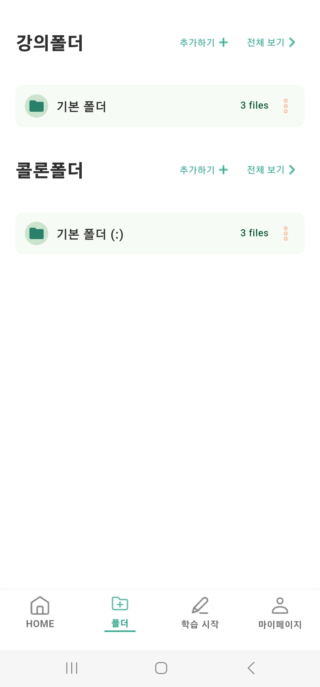

# 시·청각 장애 학습자 보조 프로그램 COMMA
### Team : 따뜻한 코끼리 마리오<br><br>

### AI 기반 학습자 맞춤형 대체텍스트/실시간 자막 및 대체학습자료 콜론 생성 프로그램
COMMA : Comment Assistant<br>
열악한 환경에서 공부해 온 시·청각 장애 학습자들에게 기술적 도움을 제공하여 ***쉼표***가 되고자 합니다

<!--Project Title Image-->
|  |  |  |  |
|---|---|---|---|
| 사용자 학습 유형 선택 | 학습 준비하기 화면 | 대체 텍스트 예시 | 콜론 예시 |

<br><br>


<!--Table of Contents-->
# 목차
- [[1] 프로젝트 코드 소개](#1-프로젝트-코드-소개)
  - [프로젝트 구조](#프로젝트-구조)
  - [소스코드 설명](#소스코드-설명)
  - [사용된 오픈소스 및 기술 스택](#사용된-오픈소스-및-기술-스택)
- [[2] 시작하기](#2-시작하기)
  - [사전 요구사항](#사전-요구사항)
  - [설치 및 설정 방법](#설치-및-설정-방법)
- [[3] 빌드 및 실행](#3-빌드-및-실행)
  - [빌드](#빌드)
  - [안드로이드 디바이스에 앱 설치](#안드로이드-디바이스에-앱-설치)
- [[4] 앱 설치 파일 공유](#4-앱-설치-파일-공유)

<br><br>

# [1] 프로젝트 코드 소개

## 프로젝트 구조
이 프로젝트는 **Flutter로 구현된 프론트엔드(COMMA**)와 **Node.js로 구현된 백엔드(SERVER)** 로 구성되어 있습니다. <br>아래는 주요 디렉토리와 파일 구조입니다. <br>
```plaintext
COMMA
│      
├─COMMA
│  │  firebase.json
│  │  pubspec.lock
│  │  pubspec.yaml
│  │  README.md
│  │
│  ├─assets
│  │          
│  ├─lib
│  │  │  10_typeselect.dart
│  │  │  12_hompage_search.dart
│  │  │  16_homepage_move.dart
│  │  │  17_allFilesPage.dart
│  │  │  1_Splash_green.dart
│  │  │  2_onboarding-1.dart
│  │  │  30_folder_screen.dart
│  │  │  31_full_folder_list_screen.dart
│  │  │  33_mypage_screen.dart
│  │  │  3_onboarding-2.dart
│  │  │  4_onboarding-3.dart
│  │  │  60prepare.dart
│  │  │  62lecture_start.dart
│  │  │  63record.dart
│  │  │  66colon.dart
│  │  │  components.dart
│  │  │  firebase_options.dart
│  │  │  main.dart
│  │  │  
│  │  ├─api
│  │  │      api.dart
│  │  │      
│  │  ├─env
│  │  │      env.dart
│  │  │      env.g.dart
│  │  │      
│  │  ├─folder
│  │  │      37_folder_files_screen.dart
│  │  │      38_folder_list.dart
│  │  │      39_folder_section.dart
│  │  │      
│  │  ├─model
│  │  │      44_font_size_provider.dart
│  │  │      45_theme.dart
│  │  │      user.dart
│  │  │      user_provider.dart
│  │  │      
│  │  ├─mypage
│  │  │      42_help_page.dart
│  │  │      43_accessibility_settings.dart
│  │  │      44_font_size_page.dart
│  │  │      
│  │  └─user
│  │          user_pref.dart                  
│              
└─SERVER
    │  google-services.json
    │  index.js
    │  package-lock.json
    │  package.json
```
<br>

<br>

## 소스코드 설명

COMMA는 시·청각 장애 학습자를 위해 다음 세 가지 주요 기능을 제공합니다.
1) 강의자료에 대한 **대체텍스트 자동 생성** 기능
2) 강의자료의 키워드 정확도를 높인 **실시간 자막 생성** 기능
3) 강의자료와 자막 스크립트를 매칭한 **대체학습자료 콜론(:)** 생성 기능

아래에서는 각 주요 기능과 관련된 파일 및 코드를 상세히 설명합니다.
<br><br>

### (1) 대체텍스트 자동 생성
이 기능은 사용자가 업로드한 강의자료를 GPT-4o API에 보내어, 자료에 대한 대체 텍스트를 생성합니다. 사용자는 결과물을 앱 화면에서 확인할 수 있습니다.<br><br>

#### 관련 파일

이 기능과 관련된 주요 파일은 다음과 같습니다:<br>
- `env.g.dart` : GPT-4o API를 사용하기 위한 OpenAI API 키를 설정하는 파일입니다.
- `60prepare.dart` : 사용자가 강의자료를 업로드하고, 이를 데이터베이스에 저장하며, 대체텍스트 생성을 위해 GPT-4o API를 호출하는 기능을 구현한 파일입니다.
- `63record.dart` : 생성된 대체 텍스트를 사용자에게 표시하는 기능을 포함한 파일입니다.
<br><br>

#### 주요 함수 설명
- **`Future<List<String>> uploadImagesToFirebase(List<Uint8List> images, int userKey)`**
  - 역할: 사용자가 업로드한 강의자료(이미지)를 Firebase Storage에 업로드하고, 각 이미지의 다운로드 URL 리스트를 반환합니다.
  - 동작: 
    1. 각 이미지 파일을 Firebase Storage에 업로드합니다.
    2. 업로드 진행률을 _progressNotifier로 업데이트합니다.
    3. 업로드 완료 후 다운로드 URL을 리스트에 저장하고 반환합니다.

<br>

- **`Future<String> callChatGPT4APIForAlternativeText(List<String> imageUrls, int userKey, String lectureFileName)`**
  - 역할: GPT-4o API를 호출하여 강의자료(이미지)의 대체 텍스트를 생성하고, 생성된 결과를 Firebase Storage에 업로드합니다. 최종 결과물의 URL을 반환합니다.
  - 동작:
    1. 각 이미지의 URL을 기반으로 GPT-4o API를 호출하여 해당 이미지의 대체 텍스트를 생성함.
    2. 생성된 텍스트를 파일로 저장하고 Firebase Storage에 업로드합니다.
    3. 각 텍스트 파일의 URL을 데이터베이스에 저장합니다.
    4. 모든 이미지를 처리한 후, 최종 결과물을 통합한 텍스트 파일을 생성합니다.
    5. 최종적으로 통합된 결과물의 다운로드 URL을 반환합니다.

<br><br>

### (2) 실시간 자막 생성
이 기능은 사용자가 업로드한 강의자료에서 추출한 핵심 키워드를 기반으로 키워드 부스팅을 수행하여, 강의자료의 키워드를 반영한 더 정확한 실시간 자막을 생성합니다.<br><br>

#### 관련 파일

이 기능과 관련된 주요 파일은 다음과 같습니다:<br>
- `60prepare.dart` : 사용자가 강의자료를 업로드하고 데이터베이스에 저장하며, 키워드 추출을 위해 GPT-4o API를 호출하는 기능을 구현한 파일입니다.
- `63record.dart` : Deepgram STT API 키 설정, 녹음 시작, 실시간 자막 생성, 녹음 종료 기능을 구현한 파일입니다.
<br><br>

#### 주요 함수 설명
- **`Future<List<String>> callChatGPT4APIForKeywords(List<String> imageUrls)`**
  - 역할: 업로드된 강의자료 이미지에서 핵심 키워드를 추출하기 위해 GPT-4o API를 호출합니다. 추출된 키워드는 중복을 제거한 뒤 Firebase에 저장하며, 데이터베이스에도 저장됩니다.
  - 동작: 
    1. 각 이미지 URL에 대해 GPT-4 API를 호출하여 키워드를 추출합니다.
    2. 중복된 키워드를 제거하고 Firebase에 저장합니다.
    3. Firebase에 저장된 키워드 파일의 URL을 데이터베이스에 기록합니다.
    4. 최종적으로 추출된 키워드 목록을 반환합니다.

<br>

- **`void _startRecording()`**
  - 역할: 녹음을 시작하고 실시간 음성 인식을 초기화합니다.
  - 동작:
    1. 녹음 상태를 recording으로 설정하고 UI 상태를 업데이트합니다.
    2. 실시간 음성 인식을 위한 스트림을 초기화합니다.
    3. 녹음기를 시작하여 음성을 캡처합니다.

<br>

- **`void _stopRecording()`**
  - 역할: 녹음을 중지하고 남은 음성을 최종 텍스트로 처리한 후 데이터베이스에 저장합니다.
  - 동작:
    1. 녹음을 중지하고 상태를 recorded로 업데이트합니다.
    2. 실시간으로 인식되지 않은 텍스트를 처리하여 최종적으로 저장합니다.
    3. 녹음 생성 시간을 가져옵니다.

<br><br>

### (3) 콜론 파일 생성
이 기능은 사용자가 업로드한 강의자료와 수업 자막 스크립트를 매칭하여, 각 강의자료 페이지에 해당하는 자막을 분리하여 보여줍니다.<br><br>

#### 관련 파일

이 기능과 관련된 주요 파일은 다음과 같습니다:<br>
- `63record.dart` : 강의자료와 자막 스크립트를 콜론 파일 생성을 위해 GPT-4o API에 전달하는 기능을 구현한 파일입니다.
<br><br>

#### 주요 함수 설명
- **`Future<bool> callChatGPT4API(String pageText1, String pageText2, String scriptText)`**
  - 역할: 두 강의자료 페이지의 텍스트와 스크립트를 비교하여, 스크립트가 어느 페이지에 해당하는지 판단합니다.
  - 동작: 
    1. GPT-4o API를 호출하여 스크립트가 어느 페이지에 속하는지 판별합니다.
    2. 결과값이 "isNext"이면 true, "isNotNext"이면 false를 반환합니다.


<br><br>

## 사용된 오픈소스 및 기술 스택

이 프로젝트는 아래와 같은 오픈소스 및 외부 서비스를 사용하여 구현되었습니다:

### 1. 프레임워크 및 언어
- **Flutter**: 크로스 플랫폼 앱 개발 프레임워크.
- **Node.js**: 백엔드 서버 개발을 위한 JavaScript 런타임.

### 2. 외부 API
- **OpenAI API**: GPT-4o 모델을 사용한 대체 텍스트 및 스크립트 분석.
- **Deepgram STT API**: 실시간 음성 인식을 위한 API.

### 3. 데이터베이스 및 스토리지
- **Firebase**: 파일 스토리지 및 사용자 데이터 관리.
- **MySQL**: 강의자료 및 키워드, 대체 텍스트 등의 데이터 저장.

### 4. 유틸리티 및 라이브러리
- **http**: Flutter에서 REST API 호출을 위한 HTTP 클라이언트.
- **provider**: 상태 관리 및 데이터 공유.
- **Express.js**: RESTful API 개발과 라우팅 관리.
<br><br><br>

# [2] 시작하기
본 튜토리얼은 Window OS 환경 및 안드로이드 환경으로 설명합니다
<br>

## 사전 요구사항
- [Nodejs 설치](https://nodejs.org/en/download/package-manager)
- [Android Studio 설치](https://developer.android.com/studio?hl=ko)
- [Flutter 설치](https://docs.flutter.dev/release/archive?tab=windows)
    - [안드로이드 스튜디오 및 플러터 환경 설정 참고 1](https://brunch.co.kr/@mystoryg/114)
    - [안드로이드 스튜디오 및 플러터 환경 설정 참고 2](https://brunch.co.kr/@mystoryg/114)
- [OPENAI API](https://platform.openai.com/) : GPT-4o API 사용하기 위해 키 발급 받기
    - [참고 블로그](https://velog.io/@ji1kang/OpenAI%EC%9D%98-API-Key-%EB%B0%9C%EA%B8%89-%EB%B0%9B%EA%B3%A0-%ED%85%8C%EC%8A%A4%ED%8A%B8-%ED%95%98%EA%B8%B0)
- Android 디바이스: 안드로이드 디바이스 또는 에뮬레이터
<br><br>

## 설치 및 설정 방법
### 1. 프로젝트 클론
```bash
git init

git clone -b dev2 --single-branch https://github.com/WarmElephantMario/COMMA.git
```


<br>


### 2. 패키지 설치
```bash
cd COMMA/COMMA

flutter pub get
flutter pub outdated
flutter pub upgrade --major-versions
```
<br>

### 3. OpenAI API 키 설정
**lib/env/env.g.dart** 에 발급받은 OpenAI API KEY를 설정합니다.

```bash
# lib/env/env.g.dart
static const String apiKey =
      'YOUR_API_KEY';
```


<br><br>


# [3] 빌드 및 실행
## 빌드
```bash
# COMMA/COMMA
flutter build apk --release
```

<br>


<br>
※ 빌드 과정 중 터미널에 아래와 같은 메시지가 표시될 수 있지만, 빌드는 정상적으로 완료됩니다.
<br>


<br>
※ 빌드 오류가 발생할 경우, 아래 명령어를 실행한 후 다시 빌드를 시도하세요.
<br>

```bash
flutter clean

flutter pub get
flutter pub outdated
flutter pub upgrade --major-versions
```


<br><br>

## 안드로이드 디바이스에 앱 설치

### 1. apk 파일 다운
**COMMA/COMMA/build/app/outputs/apk/release/app-release.apk**
<br>


이 apk 파일을 **안드로이드 디바이스**에서 다운로드 합니다.

<br>

 |  |
|---|---|

<br>

앱 설치 중 '출처를 알 수 없는 앱'이라는 알림창이 표시될 수 있습니다. 이 경우 **'무시하고 설치'** 를 선택하여 앱 설치를 진행합니다.

<br><br>

### 2. 설치 완료
앱 설치가 완료되면 COMMA 아이콘이 생성됩니다. 앱을 실행하면 온보딩 화면이 표시되며, 회원가입 없이 바로 앱 사용이 가능합니다.
<br>


 |  |  |  |
|---|---|---|---|

<br><br>

# [4] 앱 설치 파일 공유
COMMA 앱 apk 파일 공유 구글 드라이브 링크입니다. 다음의 링크에서 apk 파일을 다운 받고 앱을 설치할 수 있습니다. 기기 번호로 유저를 구분하기 때문에 회원가입/로그인 없이 바로 앱을 사용할 수 있습니다.
<br><br>
[COMMA apk 다운 링크](https://drive.google.com/file/d/1EbUwJ30K_Wvh7HdO6zuPMAvx048eEgr1/view?usp=sharing)