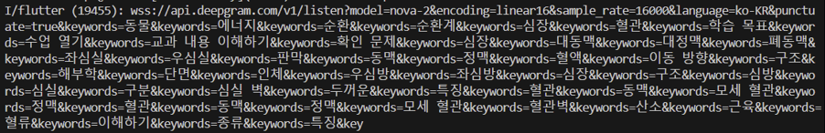

# (3) 주요엔진 및 기능 설계

본 팀이 COMMA 어플리케이션에서 설계한 주요 엔진은 **1) GPT-4o : 자연어 정보 추출 및 생성 엔진**, **2) Deepgram Speech-to-Text API : 음성 인식 엔진, 3) GPT-4o : 자연어 스크립트 개선 및 매칭 엔진**의 3가지이다. SW 구조에 나타난 3가지 주요 엔진의 설계 방식을 **(1) 설계 의도**, **(2) 엔진 구조**, **(3) 구현 방법**으로 나누어 정리하고자 한다.

### **1. GPT-4o : 자연어 정보 추출 및 생성 엔진**

 (1) 설계 의도 : 이 엔진은 강의 자료의 이미지와 텍스트를 이해하여, 강의 자료에서 중요한 정보들을 추출하고 시각적 자료에 대한 설명을 생성하는 것을 목표로 한다. OpenAI의 **멀티모달** **GPT-4o 모델**을 사용하여 강의자료의 **핵심 키워드 추출** 및 **대체텍스트 생성** 기능을 구현하였다.

 (2) 엔진 구조 : 사용자가 강의 자료를 임베드 하고 ‘강의자료 학습하기’ 버튼을 누르면, 강의자료가 GPT-4o의 입력으로 들어간다. GPT-4o는 키워드를 추출(callChatGPT4APIForKeywords)하고 대체텍스트를 생성(callChatGPT4APIForAlternativeText)한 후 이 결과를 데이터베이스에 저장한다.

 (3) 구현 방법

- 키워드 추출 프롬프팅
    
    ```dart
     Future<List<String>> callChatGPT4APIForKeywords(
    	 // ... 중략
    	 
    	final String promptForKeywords = '''
    	You are an image analysis expert. Please extract the keywords in the following image. The conditions are as follows:
    	1. Please list the non-overlapping keywords.
    	2. Please extract only the key keywords in the class.
    	3. Please list each keyword separated by a comma.
    	4. The maximum number of keywords is $maxKeywordPerPage.
    	5. Please print out all keywords in Korean.
    	''';
      
    	 // ... 중략 
     )
    
    ```
    
    키워드 추출 프롬프팅에는 총 5가지의 조건을 주었다. 
    ‘1. 중복되지 않는 키워드를 나열해 주세요’, ‘2. 수업의 주요 키워드만 추출하세요’ 등의 조건을 주어, 입력 받은 강의 자료에서 중복 없이 최대한 많은 핵심 키워드를 추출하도록 하였다.

<br>
    
- 대체텍스트 생성 프롬프팅
    
    ```dart
    Future<String> callChatGPT4APIForAlternativeText(
    	// ... 중략
     
    	const String promptForAlternativeText = '''
    	  Please convert the content of the following lecture materials into text so that visually impaired individuals can recognize it using a screen reader. 
    	  Write all the text that is in the lecture materials as IT IS, with any additional description or modification.
    	  If there is a picture in the lecture material, please generate a alternative text which describes about the picture.
    	  Visually impaired individuals should be able to understand where and what letters or pictures are located in the lecture materials through this text.
    	  Please write all descriptions in Korean.
    	  Conditions: 
    	  1. Write the text included in the lecture materials without any modifications. 
    	  2. Write as clearly and concisely as possible.
    	  3. When creating alternative text for images, do not indicate the position of the image. Instead, describe the image from top to bottom.
    	  4. Determine the type of visual content (table, diagram, graph, or other) and specify the format as [표], [그림], [그래프], etc., followed by the descriptive text.
    	    After the description, mark the end with "[표 끝]","[그림 끝]", "[그래프 끝]".
    	  5. For each slide, format the text as follows: "이 페이지의 주제는 ~~~입니다."
    	  6. Write all text in the slides as continuous prose without special characters that are hard to read aloud. This includes excluding emoticons, emojis, and other symbols that are difficult to read aloud.
    	  7. Write numbers in words to ensure smooth reading. For example, "12번" should be written as "열두번" and "23번째" as "스물세 번째".
    	  8. For mathematical formulas and symbols, write them out in text form so that they can be read aloud properly by a screen reader. This includes symbols like sigma, square root, alpha, beta, etc.
    	  9.If mathematical symbols appear, convert them into text form based on your judgment, ensuring that the symbols are not written as they are but transformed into readable text.
    	  10. When generating alternative text for images, tables, or graphs, ensure that the description provides enough detail for visually impaired individuals to fully understand the content. Include details such as the structure, data values, trends, and key information to help them grasp the meaning of the table or graph as clearly as possible.
    	  11. For tables, graphs, or diagrams, specify the format as [표], [그림], [그래프], etc., followed by the descriptive text. Ensure that the description is detailed enough so that the visually impaired can understand the content as if they were seeing the table or graph themselves. Use words to explain key insights, trends, or important data points in graphs or tables.
    	 After the description, mark the end with "[표 끝]", "[그림 끝]", "[그래프 끝]".
    	''';
     
    	// ... 중략
    ) 
    ```
    
    대체텍스트 생성 프롬프팅에는 총 11가지의 조건을 주었다.
    
    ‘1. 강의 자료에 포함된 텍스트는 수정 없이 작성한다’, ‘4. 시각적 콘텐츠 유형(표, 그래프 등)의 설명이 시작되는 부분에 [표], [그림], [그래프] 등의 태그를 주고, 설명 후 [표 끝], [그림 끝], [그래프 끝] 으로 끝을 표시한다’ 등의 조건을 주어, 강의 자료의 텍스트와 시각적 콘텐츠를 명확하게 설명할 수 있도록 하였다.
    
    
    
<br>

### **2. Deepgram Speech-to-Text API : 음성 인식 엔진**

 (1) 설계 의도 : 이 엔진은 강의자의 음성 데이터를 실시간으로 텍스트로 변환하고 콜론 파일 생성에 필요한 자막 스크립트를 제공하는 것을 목표로 한다. 이때 강의 자료에서 추출한 핵심 키워드를 사용하여 자막 정확도를 높인다. Deepgram Speech-to-Text의 **Nova-2 모델**과 ****모델의 **키워드 부스팅** 기능을 사용하여 **실시간 음성 자막 변환** 기능을 구현하였다.

 (2) 엔진 구조 : 강의 시작 시 ‘녹음’ 버튼을 누르면, 핸드폰의 마이크 기능이 활성화된다. 키워드 부스팅(buildServerUrlWithKeywords) 된 Deepgram Speech-to-Text API를 통해 실시간으로 강의자의 음성 데이터를 입력 받아, 텍스트 형태로 변환한 후 화면에 출력한다. 실시간 출력 중, 자막 텍스트를 200자 단위로 데이터베이스에 저장한다. ‘녹음 종료’ 버튼을 누르면 실시간 자막 변환이 중단되고, 마지막으로 생성된 강의 자막 스크립트를 데이터베이스에 저장한다.

 (3) 구현 방법

- 키워드 부스팅 과정
    
    ```dart
    String buildServerUrlWithKeywords(String baseUrl, List<String> keywordList) {
      final List<String> keywords = keywordList
          .expand((keyword) => keyword.split(','))
          .map((keyword) => keyword.trim())
          .toList();
      final keywordQuery =
          keywords.map((keyword) => 'keywords=$keyword').join('&');
      return '$baseUrl&$keywordQuery';
    }
    ```
    
    ‘강의 자료 학습하기’ 과정에서 추출한 핵심 키워드를 Deepgram STT API의 baseUrl 뒤에 쿼리로 붙여 키워드 부스팅을 진행한다. 키워드 부스팅 된 URL은 다음과 같다.
    
    

<br>    

- 200자 단위로 자막 스크립트 저장
    
    ```dart
    String processParagraphs(String newText, {bool? isFinal}) {
      const int maxLength = 200; // 단락을 나눌 텍스트의 최대 길이
      StringBuffer buffer = StringBuffer();
    
      combineText += newText;
      _currentLength = combineText.length;
    
      for (int i = 0; i < newText.length; i++) {
        buffer.write(newText[i]);
        if (_currentLength >= maxLength &&
            (newText[i] == '.' || newText[i] == '?' || newText[i] == '!')) {
          buffer.write('\n\n'); // 단락을 나눌 때 개행 문자를 추가
    
          // Firebase에 저장
          String paragraph = combineText.replaceAll('\n\n', ' ');
          saveTranscriptPart(paragraph);
    
          _currentLength = 0; // 카운트 초기화
          combineText = ''; // combineText 초기화
          // 새로운 단락 시작
          // buffer.clear();
        }
      }
    
    	// ... 중략
    
      return buffer.toString();
    }
    ```
  
  <br>

### **3. GPT-4o : 자연어 스크립트 개선 및 매칭 엔진**

 (1) 설계 의도 : 이 엔진은 STT를 통해 생성된 자막 스크립트에서 오류를 수정하고, 자막과 강의자료의 일치 여부를 분석하여 복습에 용이한 콜론 파일을 제공하는 것을 목표로 한다. OpenAI의 **멀티모달 GPT-4o 모델**을 사용하여 **자막 스크립트 업그레이드** 작업 및 **콜론 파일 생성** 기능을 구현하였다.

 (2) 엔진 구조 : ‘콜론 생성’ 버튼을 누르면 기존 자막 스크립트들과 키워드 리스트가 GPT-4o의 입력으로 들어간다. 핵심 키워드를 중심으로 자막의 정확도를 높이고 데이터베이스에 저장한다. 이후 수정된 자막 스크립트들과 강의자료의 대체텍스트를 GPT-4o 을 통해 매칭하여 콜론 파일을 생성한다.

 (3) 구현 방법

- 자막 스크립트 수정 및 키워드 강화 프롬프팅
    
    ```dart
    // GPT API 호출을 통한 자막 수정
    Future<String> callGptRecordUpgrade(
        List<String> keywords, String transcriptText) async {
    // ... 중략
    
    	String prompt = '''
    	You are an expert in Korean speech-to-text correction. 
    	I will provide you with a transcript and a list of keywords. 
    	Please correct any errors in the transcript while ensuring the keywords are accurately reflected.
    	Please change the words in the keyword exactly and do not change anything else. Please keep the original subtitles as much as possible, but correct strange words, spaces, and incorrect punctuation marks.
    	Please do not answer anything other than the revised subtitles. 
    	Please tell me only the revised subtitles for the answers.
    	
    	Keywords: ${keywords.join(', ')}
    	Transcript: $transcriptText
    	''';
    	
    	// ... 중략
    }
    ```
    
    자막 스크립트 수정 및 키워드 강화 프롬프팅에는 총 4가지의 조건을 주었다.
    
    ‘키워드의 단어를 정확하게 변경하고 다른 내용은 변경하지 마세요’, ‘원래 자막은 최대한 유지하되 이상한 단어, 공백, 잘못된 구두점은 수정해 주세요’ 등의 조건을 주어, 원래 자막을 유지하되 키워드를 중심으로 오타를 수정하도록 했다.
  
  <br>
    
- 자막과 강의 자료 매칭 프롬프팅
    
    ```dart
    Future<bool> callChatGPT4API(
    	// ... 중략
    	
        String prompt = '''
      You are an expert in analyzing lecture scripts. I will provide you with the text of two consecutive lecture material pages and a script segment. 
      Your task is to determine whether the provided script segment belongs to the first or the second page of the lecture material.
      Please follow these instructions:
      1. Do not modify any text in the script segment.
      2. Simply respond with "isNext" if the script belongs to the second page, or "isNotNext" if it belongs to the first page.
      3. Ensure that the response contains only "isNext" or "isNotNext". Your response must be either "isNext" or "isNotNext" only, and no other responses are allowed.
      4. If you are uncertain or it is difficult to determine, you must respond with "isNotNext".
      Page 1 Text: $pageText1
      Page 2 Text: $pageText2
      Script Text: $scriptText
      Which page does this script belong to? 
      ''';
    
      // ... 중략
      }
    ```
    
    자막과 강의 자료 매칭 프롬프팅에는 총 4가지의 조건을 주었다.
    
    ‘2. 스크립트가 두 번째 페이지에 속하는 경우 "isNext", 첫 번째 페이지에 속하는 경우 "isNext"로 응답하기만 하면 됩니다’, ‘3. 응답에 "isNext" 또는 "isNotNext"만 포함되어 있는지 확인합니다’ 등의 조건을 주어, 현재 자막이 현재 강의자료 페이지에 해당하는지 또는 다음 페이지에 해당하는 자막인지 판단하도록 하였다.

