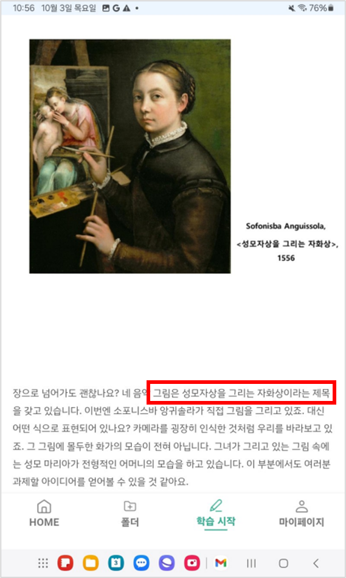

# 4. 주요 기능 구현

COMMA는 인공지능을 활용하여 장애인 학습자가 효과적으로 학습할 수 있도록 세 가지 기능을 제공한다. 1차 보고서의 Project-Summary (5) 주요 기능 리스트에 작성한 **1)대체 텍스트 생성 기능**, **2)실시간 자막 생성 기능**, **3)장애인 학습자 맞춤형 복습 자료(콜론) 생성 기능을 구현한 방법**에 대해 설명하고자 한다.

### 1. 대체 텍스트 생성 기능

**본 기능은 ‘GPT-4o : 자연어 정보 추출 및 생성 엔진’을 통해 구현되었다. COMMA의 자동 대체 텍스트 생성 기능은 강의 자료를  GPT-4o 모델에 전송하여 강의 자료의 내용과 시각적 요소를 스크린 리더가 읽을 수 있는 텍스트 설명으로 변환한다.** 

- **사용한 모듈 :** GPT-4o, 데이터베이스
- **상세 구현 내용** 
:  사용자가 강의 자료(.pdf, .jpg, .ppt 등)를 업로드하면 해당 자료가 GPT-4o 모델에 슬라이드별로 전달된다.  전달된 강의 자료 내의 모든 텍스트는 GPT-4o 모델의 광학 문자 인식(OCR) 기능을 통해 인식되어, 스크린 리더가 읽을 수 있는 텍스트 포맷으로 변환된다. 그리고 강의 자료 슬라이드에 포함된 이미지, 그래프, 도표 등의 시각적 요소는 대체텍스트 생성 프롬프트*에 맞추어 그 내용을 풀어 설명하는 텍스트로 변환된다. 각 강의 자료 슬라이드별로 생성된 대체 텍스트는 데이터베이스에 저장된다.
- **기술 튜닝 결과 :** 세부적인 대체텍스트 생성 프롬프트 전/후 결과 비교
    1. 업로드한 강의 자료
        
        
        
    2. 세부적인 대체 텍스트 생성 프롬프트 적용 전 : 
        
        
        ```dart
          Future<String> callChatGPT4APIForAlternativeText(
              List<String> imageUrls, int userKey, String lectureFileName) async {
            const String apiKey = Env.apiKey;
            final Uri apiUrl = Uri.parse('https://api.openai.com/v1/chat/completions');
        
             const String promptForAlternativeText = '''
            Please convert the content of the following lecture materials into text 
            If there is a picture in the lecture material, please generate a alternative text which describes about the picture.
          ''';
        ```
        
        
        
    3. 세부적인 대체 텍스트 생성 프롬프트 적용 후 : 
        
        
        ```dart
        Future<String> callChatGPT4APIForAlternativeText(
              List<String> imageUrls, int userKey, String lectureFileName) async {
            const String apiKey = Env.apiKey;
            final Uri apiUrl = Uri.parse('https://api.openai.com/v1/chat/completions');
        
             const String promptForAlternativeText = '''
            Please convert the content of the following lecture materials into text so that visually impaired individuals can recognize it using a screen reader. 
            Write all the text that is in the lecture materials as IT IS, with any additional description or modification.
            If there is a picture in the lecture material, please generate a alternative text which describes about the picture.
            Visually impaired individuals should be able to understand where and what letters or pictures are located in the lecture materials through this text.
            Please write all descriptions in Korean.
            Conditions: 
            1. Write the text included in the lecture materials without any modifications. 
            2. Write as clearly and concisely as possible.
            3. When creating alternative text for images, do not indicate the position of the image. Instead, describe the image from top to bottom.
            4. Determine the type of visual content (table, diagram, graph, or other) and specify the format as [표], [그림], [그래프], etc., followed by the descriptive text.
              After the description, mark the end with "[표 끝]","[그림 끝]", "[그래프 끝]".
            5. For each slide, format the text as follows: "이 페이지의 주제는 ~~~입니다."
            6. Write all text in the slides as continuous prose without special characters that are hard to read aloud. This includes excluding emoticons, emojis, and other symbols that are difficult to read aloud.
            7. Write numbers in words to ensure smooth reading. For example, "12번" should be written as "열두번" and "23번째" as "스물세 번째".
            8. For mathematical formulas and symbols, write them out in text form so that they can be read aloud properly by a screen reader. This includes symbols like sigma, square root, alpha, beta, etc.
            9.If mathematical symbols appear, convert them into text form based on your judgment, ensuring that the symbols are not written as they are but transformed into readable text.
            10. When generating alternative text for images, tables, or graphs, ensure that the description provides enough detail for visually impaired individuals to fully understand the content. Include details such as the structure, data values, trends, and key information to help them grasp the meaning of the table or graph as clearly as possible.
            11. For tables, graphs, or diagrams, specify the format as [표], [그림], [그래프], etc., followed by the descriptive text. Ensure that the description is detailed enough so that the visually impaired can understand the content as if they were seeing the table or graph themselves. Use words to explain key insights, trends, or important data points in graphs or tables.
           After the description, mark the end with "[표 끝]", "[그림 끝]", "[그래프 끝]".
          ''';
        ```
        
        
        
        대체텍스트 생성 프롬프트를 적용하기 전에는 일정한 형식 없이 설명을 생성하여 누락되는 정보가 생겼다. 또한, 생성형 인공지능이 슬라이드의 내용을 왜곡하거나 스크린 리더로 인식이 불가능한 문자를 대체 텍스트에 포함되기도 하였다. 
        
        본 팀이 개발한 대체텍스트 생성 프롬프트는 각 표나 그림을 설명하기 전후에 [표 시작], [그림 끝] 등의 태그를 붙여 시각장애인이 슬라이드의 내용을 명확하게 인식할 수 있도록 돕는다. 또한, 슬라이드에 포함된 글자는 어떠한 수정도 없이 그대로 텍스트로 추출하도록 하여 강의 자료 내의 정보가 생성형 인공지능에 의해 왜곡되지 않도록 조치하였다. 
        

### 2. 실시간 자막 생성 기능

**본 기능은 ‘Deepgram Speech-to-Text API : 음성 인식 엔진’을 통해 구현되었다. COMMA의 실시간 자막 생성 기능은 강의 자료를 GPT-4o 모델에 전송하여 해당 자료의 핵심 단어를 추출하고, 이를 통해 인식 정확도가 향상된 실시간 자막을 제공한다.**

- **사용 모듈:** GPT-4o, Deepgram API, 데이터베이스
- **상세 구현 내용**
    
    :  사용자가 강의 자료(.pdf, .jpg, .ppt 등)를 업로드하면 해당 자료가 GPT-4o 모델에 슬라이드별로 전달되고,  GPT-4o 모델의 광학 문자 인식(OCR) 기능을 통해 강의 자료 내의 모든 텍스트가 인식된다. 인식된 텍스트에서 해당 강의 자료의 핵심 키워드를 추출한다. 이후 어플리케이션의 강의실 페이지에서 강의 녹음을 시작하면, 사전에 추출된 주요 키워드가 Deepgram API의 키워드 부스팅 함수에 인자로 전달된다. 이를 통해, 실시간 강의 환경에서 자막을 생성할 때 강의 자료에 자주 등장한 주요 용어들이 더욱 정확하게 인식된다. 
    
- **기술 튜닝 결과 :** 키워드 부스팅 알고리즘을 적용한 결과, **자막 오류율이**  11.957%에서 10.870%로 **약 9.78% 감소**하였다.
    - 추출된 키워드
        
        ```jsx
        GPT-4 keywords: [동물, 에너지, 순환, 순환계, 심장, 혈관, 과학, 학습 목표, 수업 열기, 교과 내용 이해하기, 확인 문제, 심장, 대정맥, 폐정맥, 심방, 심실, 대동맥, 동맥, 판막, 근육, 우심방, 좌심방, 우심실, 좌심실, 혈액, 산소, 이동 방향, 심장구조, 심장의 구조, 심방, 심실, 구분, 심실 벽, 두껍다, 심장, 혈액, 혈관, 동맥, 모세 혈관, 정맥, 혈관, 종류, 특성, 동맥, 모세 혈관, 정맥, 혈액, 흐름, 교과 내용 이해하기, 혈액, 산소, 노폐물, 정맥, 물질 교환, 영양소, 조직, 세포, 심장, 혈관, 탄력성, 굳곳, 흐르다, 직경, 주위, 얇다, 약하다]
        
        ```
        
    - 키워드 부스팅 적용 전, 일반 STT
        
        ```jsx
        안녕하세요. 오늘은 **순화기**에 대해 알아보겠습니다.
        **순화계**는 동물의 생명유지에 필수적인 시스템으로 ..
        **신방과 심실**은 각각 **오심방 좌신방 심실 좌실시**로 구분되며 ..
        ```
        
    - 키워드 부스팅 적용 후, 인식률 향상된 STT
        
        ```jsx
        안녕하세요 오늘은 **순환계**에 대해 알아보겠습니다. 
        **순환계**는 동물의 생명유지에 필수적인 시스템으로 ..
        **심방과 심실**은 각각 **오심방, 좌심방 오심실 좌심실**로 구분되며 ..
        ```
        

### 3. 장애인 학습자 맞춤형 복습 자료(콜론) 생성 기능

**본 기능은 ‘GPT-4o : 자연어 스크립트 개선 및 매칭 엔진’을 통해 구현되었다. COMMA의 맞춤형 복습 자료(콜론) 생성 기능은 GPT-4o을 통해 강의 자막 파일을 수업 자료의 슬라이드별로 분리한 복습 자료를 생성한다.**

- **사용 모듈:** GPT-4o, 데이터베이스
- **상세 구현 내용**
    
    : 실시간 수업 중에 생성된 강의 자막 파일을 순회하며, 각 문장이 강의 자료 중 어느 슬라이드의 설명인지 분석한다. 분석 과정에서 GPT-4o 모델에 전달되는 프롬프팅은 아래*와 같다. 교수자가 특정 슬라이드의 소제목을 간접적으로 언급하거나 특정 슬라이드와 관련된 주요 키워드를 발화한 경우, 그 문장은 해당 슬라이드에 대한 설명으로 식별된다. 모든 문장에 대한 분석이 완료되면, 각 문장이 어떤 슬라이드에 해당하는지에 대한 정보가 데이터베이스에 저장된다.
    
    - ‘콜론 생성’ 버튼 클릭 → `loadAndProcessLectureData()` 함수 호출
        
        :  `loadAndProcessLectureData()` : 강의 자료의 각 슬라이드와 자막 파일의 문장들을 데이터베이스로부터 불러와 `alternativeTextUrls`와 `scriptUrls` 리스트에 저장한다. 이때 각 자막 문장들이 어느 슬라이드(페이지)에 해당하는 것인지 판단하기 위해 `divideScriptsByPages()` 함수를 호출한다.
        
    - `divideScriptsByPages()` : 강의 슬라이드는 2개 페이지씩, 강의 자막은 1개 문장씩 GPT-4o 모델에 전달하여 해당 문장이 앞/뒤 슬라이드에 해당하는지 판단한다. GPT-4o 모델에 쿼리를 보내고 응답을 받는 데 `callChatGPT4API()`함수가 사용된다. `callChatGPT4API()`로부터 페이지 응답 값을 받아, 이를 `updateRecordPage()` 함수를 통해 데이터베이스에 저장한다.
    - `callChatGPT4API()` :  GPT-4o 모델에 다음의 프롬프트를 전달하여, 한 문장이 앞/뒤 중 어느 슬라이드에 대한 설명인지 판단을 요청한다.
        
        ```jsx
            String prompt = '''
          You are an expert in analyzing lecture scripts. I will provide you with the text of two consecutive lecture material pages and a script segment. 
          Your task is to determine whether the provided script segment belongs to the first or the second page of the lecture material.
          Please follow these instructions:
          1. Do not modify any text in the script segment.
          2. Simply respond with "isNext" if the script belongs to the second page, or "isNotNext" if it belongs to the first page.
          3. Ensure that the response contains only "isNext" or "isNotNext". Your response must be either "isNext" or "isNotNext" only, and no other responses are allowed.
          4. If you are uncertain or it is difficult to determine, you must respond with "isNotNext".
          Page 1 Text: $pageText1
          Page 2 Text: $pageText2
          Script Text: $scriptText
          Which page does this script belong to? 
          ''';
        ```
        
- **기술 튜닝 결과 :**
    
    
    
    - 슬라이드의 키워드를 명시적으로 언급한 경우
    - 슬라이드에서 파악 가능한 내용을 간접적으로 언급한 경우
    
    
    - 슬라이드의 키워드를 명시적으로 언급한 경우
    
    
    - 슬라이드의 키워드를 명시적으로 언급한 경우
